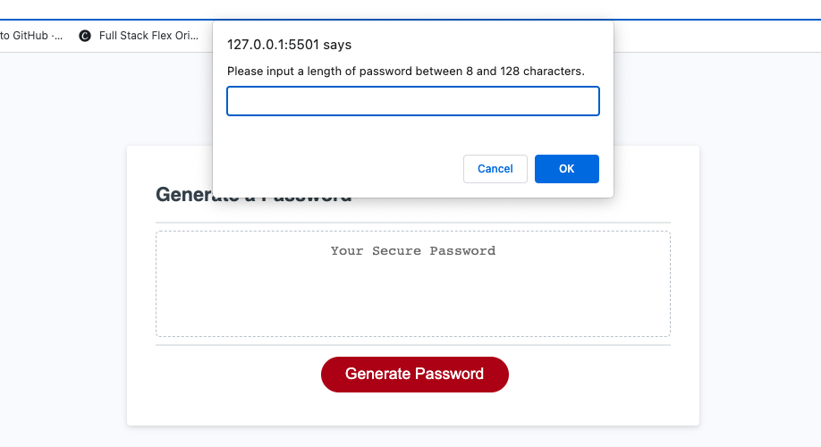

# passwordGenerator-module-3-challenge
[Link to my project](https://kassrojas.github.io/passwordGenerator-module-3-challenge/)

## Table of Contents
- [Description](#description)
- [Visuals](#visuals)

## Description
The goal of this password generator project is to put into use logic learned in JavaScript. In the application, I used for-loops, if else statements, functions, and objects. The user is prompted with questions about which character types they would like to include, as well as inputing a desired length of the password. 

## Visuals
Below is a screenshot of the working webpage:
